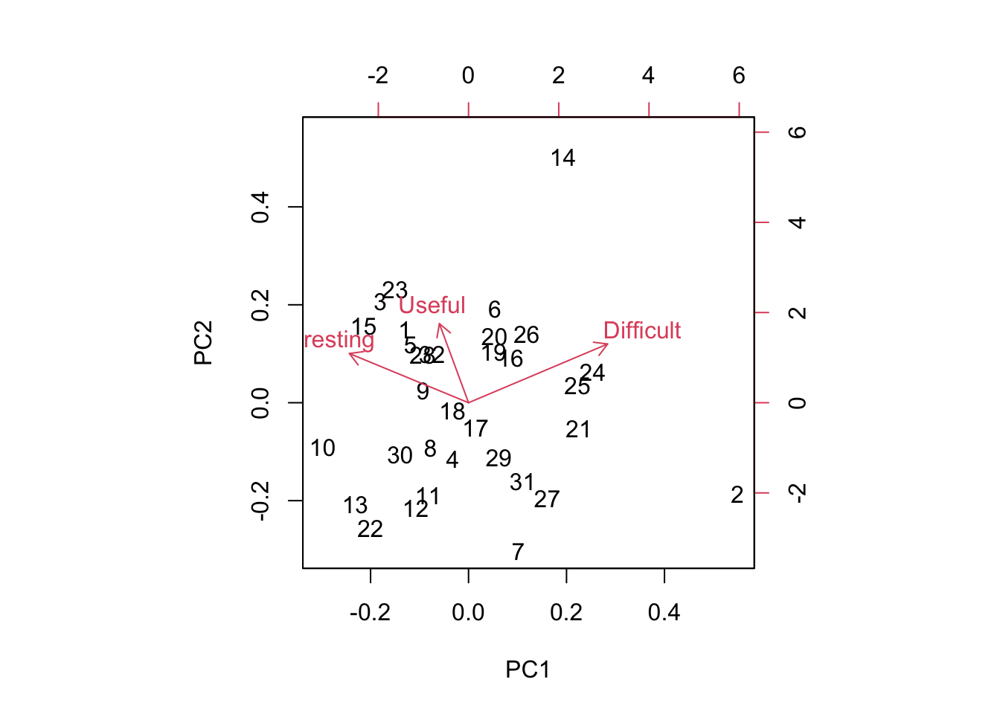

Week 14 Lab
=============

In lab we'll go through 

1. Some practice with PCA using the semester survey results

2. Some practice with GLMs using the semester survey results

There are a number of functions you could use in R to do principal components analysis. We will use the 'prcomp' function, but there is a very closely related function called 'princomp' as well as a function called 'principal' which is in the 'psych' package.


```r
readings<-read.csv("~/Dropbox/Biometry/Week 14 Multivariate analyses and Review/Week 14 Lab/Readings 2020.csv",header=T)

missing<-which(is.na(readings$Useful)|is.na(readings$Difficult)|is.na(readings$Interesting))
Useful<-aggregate(readings$Useful[-missing], by=list(Index=readings$Index[-missing]),FUN=mean)$x

Difficult<-aggregate(readings$Difficult[-missing], by=list(Index=readings$Index[-missing]),FUN=mean)$x

Interesting<-aggregate(readings$Interesting[-missing], by=list(Index=readings$Index[-missing]),FUN=mean)$x

Length.means.readings<-aggregate(readings$Length[-missing], by=list(Index=readings$Index[-missing]),FUN=mean)$x

pca.result<-prcomp(~Useful+Interesting+Difficult,retx=T)
```

Before printing out the result, let's make sure everyone understands what I was doing with the aggregate commands, and how the 'prcomp' function input works. 

To print out a summary of the PCA, we use


```r
summary(pca.result)
```

```
## Importance of components:
##                           PC1    PC2    PC3
## Standard deviation     1.0232 0.6395 0.4109
## Proportion of Variance 0.6444 0.2517 0.1039
## Cumulative Proportion  0.6444 0.8961 1.0000
```

We see that PCA1 is associated with over 64% of the variation in responses. So, what is PCA1?


```r
pca.result$rotation
```

```
##                     PC1        PC2        PC3
## Useful      -0.63382221  0.4348484  0.6396689
## Interesting -0.04763128  0.8034897 -0.5934101
## Difficult   -0.77201079 -0.4065847 -0.4885573
```

PCA1 is an axis which describes papers that are Not Useful and not Difficult, with a very small weight towards papers that are not Interesting. In other words, a large positive PCA1 score would be associated with an Easy paper that was not Useful. Note that the principal components denote an axis, but the direction is arbitrary. Since no direction is implied by the sign, we do not interpret this as saying that most papers were Not Useful, Not Difficult, and Not Interesting. Instead we would say that the papers largely fall along a common axis in which Easy/Boring/Useless papers are at one end, and Difficult/Interesting/Useful papers are at the other end. (Obviously, the goal is to weed out the former in favor of the latter over time.)

We can visualize this using the function 'biplot'


```r
biplot(pca.result)
```



Biplots take some getting used to, and when they have many more dimensions, they become increasingly difficult to interpret. However, papers high on PC1 are generally Easy but Not Useful and papers high on PC2 are generally Useful and Interesting but Not Difficult. 

So which papers came out as highly negative on the PC1 axis? Remember, these are the most "Useful" but "Difficult"?


```r
readings[readings$Index==14,1][1]
```

```
## [1] Shmueli (2010) To explain or predict? Statistical Science 25(3): 289-310.
## 33 Levels: Altman, N., and M. Krzywinski. 2015. Sources of variation. Nature Methods 12(1): 5-6. ...
```

```r
readings[readings$Index==16,1][1]
```

```
## [1] Hulbert, S. H. 1984. Pseudoreplication and the design of ecological field experiments. Ecological Monographs 54(2): 187-211.
## 33 Levels: Altman, N., and M. Krzywinski. 2015. Sources of variation. Nature Methods 12(1): 5-6. ...
```

Perhaps not surprising! 

You can play around with this yourself and see why I added the [1] at the end. When I pull out the rows with the Index identified by the PCA, I get the list of all entries (since we had >1 team rating the papers) and so I only print the first one.

Which papers were highly positive on PC2? (Not Difficult but Interesting and Useful)


```r
readings[readings$Index==1,1][1]
```

```
## [1] Johnson, D.H. 1995. Statistical sirens: The allure of nonparametrics. Ecology 76(6): 1998-2000.
## 33 Levels: Altman, N., and M. Krzywinski. 2015. Sources of variation. Nature Methods 12(1): 5-6. ...
```

```r
readings[readings$Index==3,1][1]
```

```
## [1] Johnson, D.H. 2002. The role of hypothesis testing in wildlife science. The Journal of Wildlife Management 66(2): 272-276.
## 33 Levels: Altman, N., and M. Krzywinski. 2015. Sources of variation. Nature Methods 12(1): 5-6. ...
```

```r
readings[readings$Index==10,1][1]
```

```
## [1] Gawande (1999) The cancer cluster myth. The New Yorker.
## 33 Levels: Altman, N., and M. Krzywinski. 2015. Sources of variation. Nature Methods 12(1): 5-6. ...
```

There are two papers out at the end of Not Useful:


```r
readings[readings$Index==12,1][1]
```

```
## [1] Wainer, H. 1984. How to display data badly. The American Statistician 38(2): 137-147.
## 33 Levels: Altman, N., and M. Krzywinski. 2015. Sources of variation. Nature Methods 12(1): 5-6. ...
```

```r
readings[readings$Index==31,1][1]
```

```
## [1] Gelman, A. 2011. Open data and open methods. Chance 24(4): 51-53.
## 33 Levels: Altman, N., and M. Krzywinski. 2015. Sources of variation. Nature Methods 12(1): 5-6. ...
```

Both papers relate to the more general issues relating to data display and data reproducibility. I hope these ideas prove useful later, but I can understand why they don't seem as immediately useful to Biometry as some of the other readings we did.

We can do the same for the problem sets:


```r
PS<-read.csv("~/Dropbox/Biometry/Week 14 Multivariate analyses and Review/Week 14 Lab/ProblemSets 2020.csv",header=T)

# In this case there were no missing data
Useful.means.PS<-aggregate(PS$Useful, by=list(Index=PS$Week),FUN=mean)$x

Difficult.means.PS<-aggregate(PS$Difficult, by=list(Week=PS$Week),FUN=mean)$x

Interesting.means.PS<-aggregate(PS$Interesting, by=list(Week=PS$Week),FUN=mean)$x

pca.result<-prcomp(~Useful.means.PS+Interesting.means.PS+Difficult.means.PS,data=PS,retx=T)
```

Notice that it has simply labeled them in order, so 7=Week #9 PS, 8=Week #10 PS, 9=Week #11 PS, 10=Week #12 PS, and 11=Week #13 PS.

To print out a summary of the PCA, we use


```r
summary(pca.result)
```

```
## Importance of components:
##                           PC1    PC2     PC3
## Standard deviation     0.7671 0.4910 0.23598
## Proportion of Variance 0.6648 0.2723 0.06291
## Cumulative Proportion  0.6648 0.9371 1.00000
```

We see that for the problem sets, PC1 is slightly more dominant (66% of the variation). So, what is PCA1?


```r
pca.result$rotation
```

```
##                             PC1        PC2         PC3
## Useful.means.PS      -0.4563116 -0.7401567 -0.49391070
## Interesting.means.PS -0.1706660 -0.4719635  0.86494138
## Difficult.means.PS    0.8733000 -0.4789765 -0.08904282
```

PC1 is dominated by "Difficult". A large positive PC1 score indicates a problem set that was difficult. PC2 is related primarily to whether a problem set was judged "Useful"" but also has strong weight divided nearly equally between "Interesting" and "Difficult" so positive PC2 values indicate "Not Useful" and "Not Interesting" but "Easy". (Reminder: the signs of the PCs is arbitrary, so R could have given us this same information flipped on its axis, and made positive PC2 values associated with "Useful" and "Interesting" and "Difficult".) Its a little hard to say in this case which quadrat we "want", but if "Useful" is the most important metric, than we want problem sets that are as far as possible in the lower left section of the biplot and we want to avoid problem sests in the far upper right corner.


```r
biplot(pca.result)
```


Luckily (for us all) nothing really stands out in the upper right corner. (Over the years, this exercise has eliminated the worst performing problem sets, so there are no major outliers anymore, though perhaps Week #12 [number 10 on the biplot] still needs some tweaking. Suggestions on all the problem sets most welcome.)

Missing at random - practice with GLMs
--------------------------------------

There were missing data for some of the readings. One could ask the question, are these data missing at random? In the problem set for Week #13, we completed the dataset using random imputation. In other words, we assumed that data were missing at random and we drew with replacement from the other values to replace missing datapoints. However, in this case, it seems likely that data are not missing at random. I suspect that papers were not evaluated because no one read them, and that something about the papers may predict whether the papers were read or not. We can answer this question by constructing a model for "missingness" which assumes that the probability of being evaluated is distributed as Binom(n,p) where p is the probability of being evaluated (and presumably, of having been read in the first place).

First, I need to go through the data and figure out how many times a paper was evaluated. 


```r
num.missing<-vector(length=max(readings$Index))
for (i in 1:max(readings$Index))
{
  num.missing.useful<-sum(as.numeric(is.na(readings$Useful[readings$Index==i])))
  num.missing.difficult<-sum(as.numeric(is.na(readings$Difficult[readings$Index==i])))
  num.missing.interesting<-sum(as.numeric(is.na(readings$Interesting[readings$Index==i])))
  max.missing<-max(num.missing.useful,num.missing.difficult,num.missing.interesting)
  num.missing[i]<-max.missing
}
```

For simplicity, I am considering "evaluated" as evaluated for all three categories (Useful, Difficult, and Interesting).

Now I use a Binomial GLM to model the probability of being evaluated as a function of Useful, Interesting, and Difficult (as rated by the other groups). Note that there were 4 groups (A-C plus a group of 2 students that missed Tuesday) total, so n=4.


```r
fit<-glm(cbind(4-num.missing,num.missing)~Useful+Difficult+Interesting,family="binomial")
summary(fit)
```

```
## 
## Call:
## glm(formula = cbind(4 - num.missing, num.missing) ~ Useful + 
##     Difficult + Interesting, family = "binomial")
## 
## Deviance Residuals: 
##     Min       1Q   Median       3Q      Max  
## -1.4683   0.1489   0.3054   0.4337   1.3082  
## 
## Coefficients:
##             Estimate Std. Error z value Pr(>|z|)
## (Intercept)  -3.5318     2.6969  -1.310    0.190
## Useful        0.4905     0.7953   0.617    0.537
## Difficult     1.2288     0.8455   1.453    0.146
## Interesting   0.8669     0.6762   1.282    0.200
## 
## (Dispersion parameter for binomial family taken to be 1)
## 
##     Null deviance: 21.823  on 32  degrees of freedom
## Residual deviance: 13.605  on 29  degrees of freedom
## AIC: 31.962
## 
## Number of Fisher Scoring iterations: 6
```

None of the covariates are significant, which isn't a surprise. Because I (accidentally) didn't pass out the Week 14 readings until Tuesday, it was only the Week 14 readings that had NAs, so we would not expect (except possibly by chance) any association with the factors of Useful, Difficult, or Interesting. 

We might suspect a high degree of multicollinearity among the predictors. We can use PCA to create new orthogonal covariates which (more efficiently) capture the variability in the survey results. 

I will rerun the PCA for the readings.


```r
pca.result<-prcomp(~Useful+Interesting+Difficult,retx=T)
summary(pca.result)
```

```
## Importance of components:
##                           PC1    PC2    PC3
## Standard deviation     1.0232 0.6395 0.4109
## Proportion of Variance 0.6444 0.2517 0.1039
## Cumulative Proportion  0.6444 0.8961 1.0000
```

```r
pca.result$rotation
```

```
##                     PC1        PC2        PC3
## Useful      -0.63382221  0.4348484  0.6396689
## Interesting -0.04763128  0.8034897 -0.5934101
## Difficult   -0.77201079 -0.4065847 -0.4885573
```

PCA1 captures about 60% of the variability, so we try using just PCA1 in our GLM. 


```r
fit<-glm(cbind(4-num.missing,num.missing)~pca.result$x[,1],family="binomial")
summary(fit)
```

```
## 
## Call:
## glm(formula = cbind(4 - num.missing, num.missing) ~ pca.result$x[, 
##     1], family = "binomial")
## 
## Deviance Residuals: 
##     Min       1Q   Median       3Q      Max  
## -1.6068   0.1929   0.3408   0.4717   1.2890  
## 
## Coefficients:
##                   Estimate Std. Error z value Pr(>|z|)    
## (Intercept)         3.6863     0.6769   5.446 5.15e-08 ***
## pca.result$x[, 1]  -1.2112     0.5325  -2.275   0.0229 *  
## ---
## Signif. codes:  0 '***' 0.001 '**' 0.01 '*' 0.05 '.' 0.1 ' ' 1
## 
## (Dispersion parameter for binomial family taken to be 1)
## 
##     Null deviance: 21.823  on 32  degrees of freedom
## Residual deviance: 14.951  on 31  degrees of freedom
## AIC: 29.307
## 
## Number of Fisher Scoring iterations: 6
```

Not surprisingly, the first PC actually more significant than any of the individual factors alone. (And this is just an artifact, since the missingness is in fact related only to Week.) What if we look instead at the length of each paper?


```r
fit<-glm(cbind(4-num.missing,num.missing)~Length.means.readings,family="binomial")
summary(fit)
```

```
## 
## Call:
## glm(formula = cbind(4 - num.missing, num.missing) ~ Length.means.readings, 
##     family = "binomial")
## 
## Deviance Residuals: 
##     Min       1Q   Median       3Q      Max  
## -1.5078   0.4354   0.5848   0.6606   0.7105  
## 
## Coefficients:
##                       Estimate Std. Error z value Pr(>|z|)    
## (Intercept)            2.63135    0.69342   3.795 0.000148 ***
## Length.means.readings  0.04997    0.07654   0.653 0.513846    
## ---
## Signif. codes:  0 '***' 0.001 '**' 0.01 '*' 0.05 '.' 0.1 ' ' 1
## 
## (Dispersion parameter for binomial family taken to be 1)
## 
##     Null deviance: 21.823  on 32  degrees of freedom
## Residual deviance: 21.187  on 31  degrees of freedom
## AIC: 35.544
## 
## Number of Fisher Scoring iterations: 6
```

Length is not statistically correlated with whether a paper was rated, which is not surprising in this case because we know that the only papers not rated were the ones for the last week.
